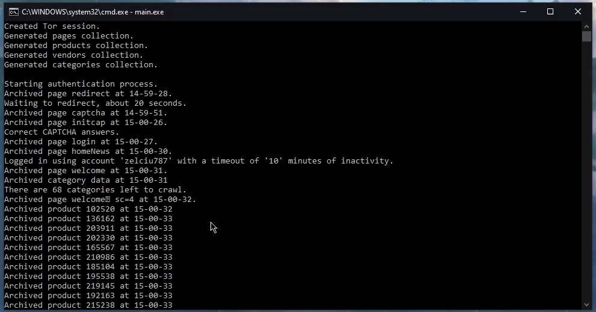
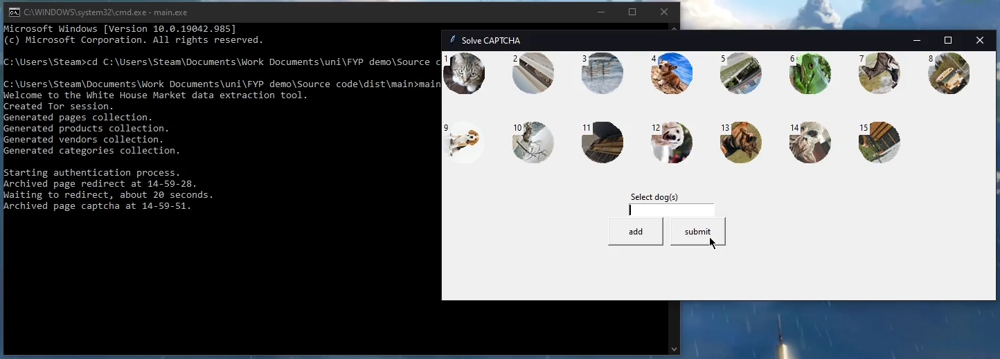
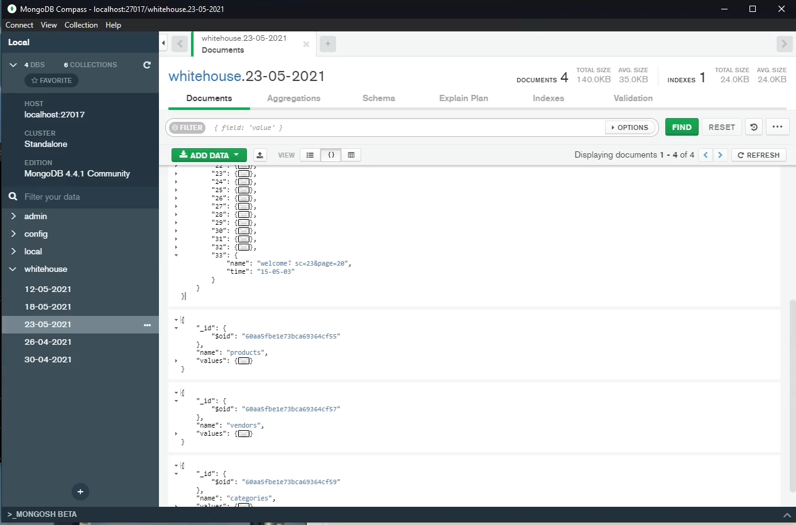

# :no_entry: Current Status :no_entry:
> [!CAUTION]
> **White House Market no longer exists, therefore this tool no longer works.**

# Darknet market Crawler & Scraper
This tool was created for my final year project. It crawls and scrapes the darknet marketplace White House Market, populating statistical data into MongoDB.

# Screenshots

# Run
Developed and tested on Windows 10, other operating systems aren't supported.

To use the tool start MongoDB server 4.4.

Then either open the Tor browser or download and open the Tor binary in the Expert Bundle from https://www.torproject.org/download/tor/

Running main<area>.py requires the Python packages:
bs4, datetime, pymongo, tkinter, PIL, shutil, re, w3lib.url and standard packages os, random, time

# Past data
Some example data collected can be found at [23-05-2021.json](23-05-2021.json).
